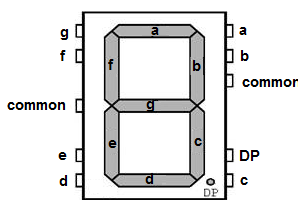
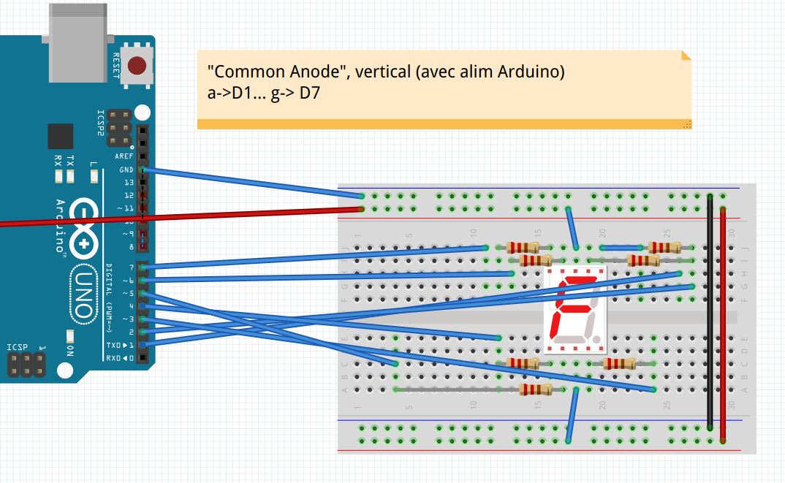
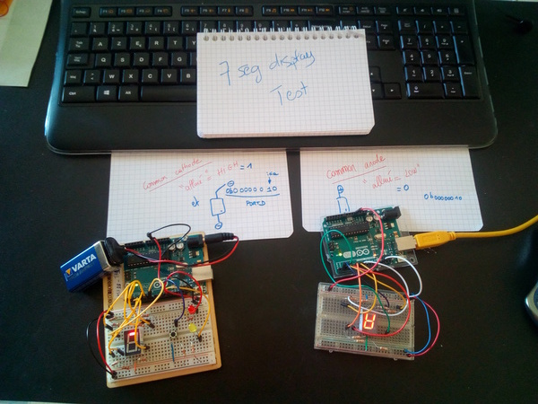

# Arduino Lab  - startup for 7 seg

### 7 segments display . (Common Anode OR Common Cathode)

* 7 segments labels:

 

* 7 segment : a on digital 1 via resistor 220 ohm, b on digital 2, ...
  g on digital 7, according to the preceding numbering. 
  
**Warning, the 7 segment display should be connected though resistors
(from 220 to 400 ohm) -- NEW PICTURE**

* Plug your 7 segment as if it was Common Anode (most probably it is the case) like in the following picture:

(comon anode can be horizontal or vertical, be careful).

* Test your wiring with the test file in `_code/test7segV2` (you have a Readme file) Understand this code. From now, you should know if you have a CC or CA 7-segment display.

