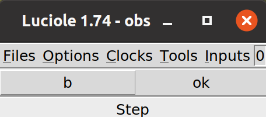
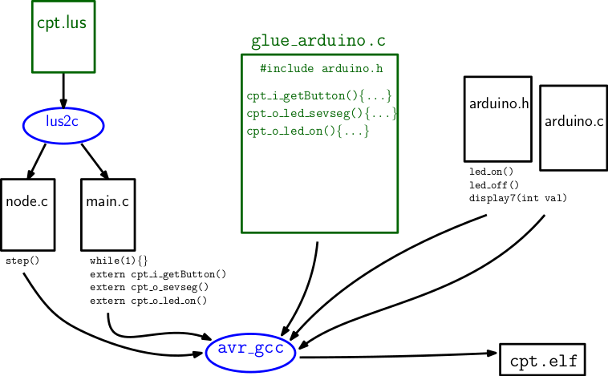

# CS 442 . Lab: Lustre Compilation

  * Laure Gonnord
  * Version: 2021.01

## Problem Description 

In this lab you will be asked to write simple Lustre programs and compile a whole toolchain starting from Lustre to Arduino.

All useful given code (and more) is in this [code directory](_code/)

## Step 0 : Arduino Startup

### Installation & Board.

Your Arduino plateform should be operational:
* See last lab [startup](../TP1_Arduino/_startup-arduino.md)
* Button + Led + 7segment.
* The code inside `TP1_Arduino/_code/Test7segV2/` should work.

### Functionality

See last lab. You should have an Arduino C code that performs the following behavior:
  1. Switch on or off a LED based on a button sensor;
  2. Building a simple counter using a 7-segment display;
  3. Compose the two behaviors so that the button control both the display and the LED.


## Step 1 : Lustre Startup 

If you encounter any problem for installing Lustre V4, refer to [this page](https://www-verimag.imag.fr/DIST-TOOLS/SYNCHRONE/lustre-v4/distrib/index.html)


### Lustre Install (see `_code/startup_lustre.md`)

* We give you a nice script that: installs Lustre and opens a terminal where all useful environment variables have been set:  `./lance_lustre linux64` should work out-of-the-shelf: `make` should open a nice old simulation GUI like : 



If yes, congrats, everything is working fine. Now we will try to understand what is exactly done during the compilation process.

### A simple compilation  and simulation (tuto) (`_code/LustreExamples`)

* Observe the content of  `edge.lus`:

```Lustre
node edge (b : bool) returns (edge : bool);
     let
        edge = false -> b and not pre b;
     tel
```
and try to infer the behavior of this program.

* Make an interactive simulation with luciole :  open the simulator with `luciole edge.lus edge` (or `make`) and give values to the boolean input b. 

* Invoke `lustre` compiler "in simulation mode" with: `lus2c edge.lus edge -loop`, and observe the three generated files: explain the purpose of each file. Compile these files with your favorite C compiler (or gcc): `gcc -o edge edge.c edge_loop.c` and play with the simulation binary. What is it useful for?

* Also test the `demo7seg.lus` file.

At this step, our I/O are printf and scanf (and they synchronise the loops, too), let's do a step further.

## Step 2 : Lustre to Arduino compilation chain (`_code/Arduino7seg`)

The compilation chain into Arduino is depicted in the next picture:



In a **new**  directory:
* make a "library" `glue_arduino.c` and its `glue_arduino.h` that exposes at least the three useful functions; 
```
void setup();
void turnOff();
void displayDigit(int digit);
```
Create a new Makefile and a `test.c` to validate the functionalities of your library.
* Copy the simulation loop `cpt_loop.c` obtained from the `demo7seg.lus` (and perhaps its companion files) into `_code/Arduino7seg/main.c` and edit it so that to replace I/O for simulation (printf, scanf) by arduino I/O **note that from now this file is no longer "automatically generated"**. It could be useful to include some headers:
```C
#include <stdlib.h>
#include <avr/io.h>
#include <util/delay.h>

#include "cpt.h"
#include "glue_arduino.h"
```
and also to add some:
* Compile, test.
* Modify the behavior (inside the Lustre program) so that the counter resets only if the reset is pushed 2 sucessive cycles. Describe carefully how you proceed on your notes. What files need to be regenerated ?

## Step 3 Practise Lustre (HW :pencil:)

Now that we have shown a working toolchain for Arduino, let us come back to standalone Lustre programs. 

The main features of the language are described in [this tutorial](https://www-verimag.imag.fr/DIST-TOOLS/SYNCHRONE/lustre-v4/distrib/lustre_tutorial.pdf) (pages 1 to 11)

:warning:  :pencil: TODO : Make a deposit of the following on Chamilo before the next lab:

### Exercise 1: Air-conditioner controller

We want to write a Lustre node implementing an air-conditioner controller.
```Lustre
node AC_Controller (onOff: bool; tAmb, tUser: int)
returns (isOn: bool; tOut: int) ;
-- COMPLETE
```

* `onOff` is a boolean signal, true whenever the `onOff` button of the air conditioner is pushed (every time the user pushes this button, the state of the air-conditioner changes from `isOn=true` to `isOn=false` and conversely).
* `tAmb` is the ambient temperature (in degrees).
* `tUser` is the temperature required by the user and that the room must reach.
* `tOut` is the temperature of the air issued by the air-conditioner. You must choose a (reasonable but not necessarily accurate) way to compute this temperature.

 

### Exercise 2: Roller shutter controller

We want to write a Lustre node controlling the automatic opening and closing of the roller shutters of a window:
```Lustre
node Shutter_Controller(onOff, isOpen, isClosed: bool; luminosity, time: int) returns (isOn: bool; open, close: bool); 

-- COMPLETE
```
 
* `onOff` is true whenever the "`onOff`" button of the device is pushed (every time the user pushes this button, the state of the controller changes from `isOn=true` to `isOn=false` and conversely).
* `isOpen` and `isClosed` are true if the shutters are respectively in open or closed position. These two parameters cannot be simultaneously true but may, instead, be simultaneously wrong (half closed shutter).
* `luminosity` represents information sent by a light sensor as an integer ranging from 0 (full darkness) to 10 (full day).
* `time` is an integer ranging from 0 to 23 and corresponds to the current hour.
* `open`, `close` are commands sent to the shutter. They must ensure that the following properties are satisfied: between 22:00 and 6:00 the shutters are closed. During the rest of the time, if luminosity exceeds 6, the shutters should close; if it is less than 4, they should open. Otherwise, they remain in the same state.
 

### Exercise 3 : Stopwatch

Write a Lustre node implementing a stopwatch with four buttons:
* `Start`: starts or restarts the time count.
* `Stop`: stops the time count.
* `Freeze`: if the stopwatch runs, this button "freezes" the displayed time but does not stop the time count. If pushed again the time count is displayed again.
* `Reset`: works only if the stopwatch is stopped, in which case the time count is set to 0.
