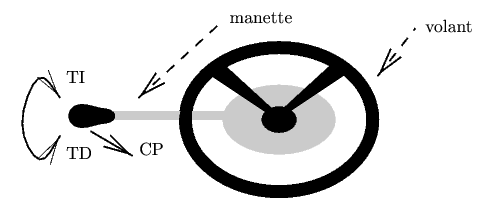
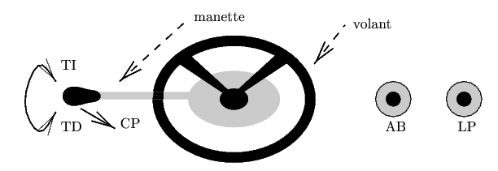

# CS 442 TP4 Lab: Lustre Verification Practise

  * Laure Gonnord
  * Version: 2021.01
  * Copyright Pascal Raymond for Ensimag/M2 MOSIG, Grenoble
  * and  Lustre Lab real time M1 option @UCB Lyon1 2015-2018

## Problem Description 

In this lab you will be asked to write simple code ans simple proofs of their functionnality.

All useful code is in this [code directory](_code/)

## Step 0 : Redo the course's demos [if necessary]

Cf the slides of the course (redo the beacon example)
The `lustre-tuto.ensimag.pdf` (also on Chamilo) can be of great help.

## Step 1 : Tiny exercises : write observers and test

### Step 1.1 Observe !

Predict (without launching the code), the behavior of the following nodes:

* The switch : 
``` Lustre
node switch(orig, on, off : bool) returns (s : bool);
let
   s = if(orig -> pre s) then not off else on;
tel
```

* jafter 
```
node jafter(x : bool) returns (jax : bool);
let
   jax = false -> pre x;
tel
```
* edges 
```
node edge(x : bool) returns (e : bool);
let
   e = x and not(jafter(x));
tel

node xedge(x : bool) returns (e : bool);
let
   e = x and (jafter(not x));
tel
```

* once between 
```
node once_between(x,a,b: bool) returns (ok: bool);
var in_a_b: bool;
    x_in_a_b: bool;
let
	in_a_b = switch(false, a, b);
	x_in_a_b = switch(false, x and in_a_b, b);
	ok = xedge(not in_a_b) => xedge(not x_in_a_b); 
tel
```


### Step 1.2 Lesar simple practise (yes, in French)

Écrire un noeud lustre `nonon` qui calcule l'inverse de son entrée booléenne. Écrire un noeud observateur qui répond `faux` si la sortie
  du noeud précédent a été fausse dans le passé. Vérifier avec
  `luciole` que cet observateur peut répondre faux. Vérifier avec
  `lesar` qu'il existe un contre-exemple. Ajouter dans le noeud
  observateur une assertion de la forme:
```
   assert (x);
```

où `x` est l'entrée du noeud observateur, et l'argument d'appel du
noeud `nonon` Refaites les manipulations précédentes.


## Step 2 : (HW) write and prove

:warning:  :pencil: TODO : Make a deposit of ** this exercise only **  on Chamilo before the next lab: (.lus + Readme)

Source : Pascal Raymond, Verimag, et Emanuelle Encrenaz, LIP6. 

### Remarque
Pour cet exercice, il peut être judicieux de raisonner en terme
d'automate à états, et d'utiliser intensivement les noeuds auxiliaires
`switch, jafter`. Ces deux noeuds et d'autres que vous serez amenés à
écrire pourront judicieusement être placés dans le fichier
`utiles.lus` déjà présent dans le dépôt.


### Fonctionnalité

Une voiture dispose de trois types de lampes: veilleuses, codes et
phares. Le conducteur dispose d'une manette qui dispose de plusieurs
degrés de liberté.

On souhaite décrire en Lustre le module de contrôle des feux d'une
voiture. L'utilisateur entre ses ordres via une manette et une série
d'interrupteurs, agissant sur les phares de la voiture.




La manette peut être tournée dans le sens direct (TD) ou indirect (TI);
A partir d'une situation initiale où tout est éteint, TD allume les veilleuses, un second TD éteint les veilleuses et allume les codes;
Lorsqu'on est en codes ou en phares, TI les éteint et rallume les veilleuses, un second TI éteint tout;
Le fait de tirer la manette vers l'avant (CP) permet de commuter entre codes et phares; lorsqu'on est en codes, CP éteint les codes et allume les phares, un second CP éteint les phares et rallume les codes;
Le conducteur ne peut pas simultanément tourner et tirer la manette.

### Contrôleur V1


Pour les variables d'entrée, on prendra trois variables booléennes TD,
TI et CP, vraies aux instants où l'action correspondante est effectuée
par le conducteur.

Pour les sorties, on choisit trois flots qui représentent l'état des
lampes : veilleuses (resp. codes, phares) est vrai tant que les
veilleuses (resp. les codes, les phares) sont allumées, et est faux
tant qu'elles sont éteintes.

:pencil:
Après avoir dessiné un automate à états, utiliser le noeud
`switch` (et `jafter`) pour
décrire les transitions dans un noeud Lustre. Simuler et tester ce
noeud.


### Contrôleur de feux (version étendue - V2)





On ajoute à présent des projecteurs antibrouillard et de longue
portée. Deux boutons-poussoirs permettent d'activer les feux
antibrouillard (bouton AB) et les longue portée (bouton LP), comme
illustré à la figure ci-dessus.

* Le rôle de la manette est inchangé.

* A partir d'une situation initiale, une pression sur AB (resp. LP) sélectionne les antibrouillard (resp. les longue portée), et une seconde pression les désélectionne.

* Les antibrouillards (resp. les longues portées) ne sont allumés que quand on est en codes (resp. en phares). Dans ce cas, ils ne sont allumés que s'ils sont sélectionnés.


#### Indications~:
On conserve les entrées et sorties de la version simple, auxquelles on ajoute :
* deux entrées AB et LP vraies à chaque pression du bouton correspondant.
* deux sorties `anti_brouillard` et `longue_portee` représentant l'état des projecteurs d'antibrouillard et de longue portée (vrai : allumé, faux : éteint).

_Il pourra être judicieux de s'apercevoir que le noeud
  `switch` peut être utilisée avec la même commande on/off_

### Verification du contrôleur V2

En utilisant `xlesar`, vous essayerez de prouver les propriétés suivantes sur le contrôleur de feux (étendu) :
* veilleuse, code et phare sont exclusifs. (on pourra utiliser
  l'opérateur d'exclusivité `#`)
* on ne peut être en antibrouillard que si on est en code.
* on ne peut être en longue-portée que si on est en phares.

Si une preuve échoue : utiliser l'option ``Diagnosis'' de `xlesar` pour
obtenir un contre-exemple. On sera éventuellement amené à introduire
des hypothèses sur les entrées pour mener à bien la preuve.
